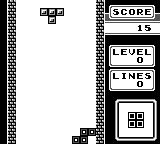
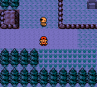
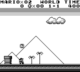

<p align="center">

</p>

__If you have any questions, or just want to chat, [join us on Discord](https://discord.gg/Zrf2nyH).__

Sources for making AI and bots
==============================
If you are looking to make a bot or AI, then these resources is a good place to start:
 * [PyBoy API Documentation](https://baekalfen.github.io/PyBoy/index.html)
 * [Wiki Pages](https://github.com/Baekalfen/PyBoy/wiki/)
   * [Using the Gym](https://github.com/Baekalfen/PyBoy/wiki/Scripts,-AI-and-Bots)
   * [Generic scripts and bots](https://github.com/Baekalfen/PyBoy/wiki/Scripts,-AI-and-Bots)
 * [Examples](https://github.com/Baekalfen/PyBoy/tree/master/examples)
 * [Discord](https://discord.gg/Zrf2nyH)

<!---
Generate GIF with the layout and captions
-->
<table>
  <tbody>
    <tr>
      <td colspan=2 align="center"><a href=https://github.com/PWhiddy/PokemonRedExperiments>Train RL agents to play Pokemon Red</a>
      </td>
    </tr>
    <tr>
      <td colspan=2 align="center">
        <div align="center">
        <a href="http://www.youtube.com/watch?feature=player_embedded&v=DcYLT37ImBY" target="_blank">
        
        </a>
        <!-- https://www.youtube.com/watch?v=DcYLT37ImBY -->
        <!-- <br> -->
        </div>
      </td>
    </tr>
    <tr>
      <td align="center"><a href=https://github.com/Baekalfen/PyBoy/wiki/Experimental-and-optional-features#rewind-time>Rewind any game</a><br>
      </td>
      <td align="center"><a href=https://github.com/uiucanh/tetris>Beat world records with AI</a><br>
      </td>
    </tr>
    <tr>
      <td align="center">
        
      </td>
      <td align="center">
        
      </td>
    </tr>
    <tr>
      <td align="center">Play the classics<br>
      </td>
      <td align="center"><a href=https://github.com/lixado/PyBoy-RL>Train your own AI</a><br>
      </td>
    </tr>
    <tr>
      <td align="center">
        
      </td>
      <td align="center">
        
      </td>
    </tr>
  </tbody>
</table>

Performance
===========
<table>
  <tbody>
    <tr>
      <td align="center">
        `pyboy.screen()` in null mode
      </td>
      <td align="center">
        `pyboy.game_area()` in null mode
      </td>
    </tr>
    <tr>
      <td>
      x59 realtime
      </td>
      <td>
      x282 realtime
      </td>
    </tr>
    <tr>
      <td align="center">
        
      </td>
      <td align="center">
        
      </td>
    </tr>
  </tbody>
</table>

Installation
============
The instructions are simple if you already have a functioning Python environment on your machine.

 1. Install PyBoy using __`pip install pyboy`__ (add __` --user`__ if your system asks)
 2. If your system isn't supported by [pysdl2-dll](https://pypi.org/project/pysdl2-dll/), you'll need to install SDL2 from your package manager.

For details, see [installation instructions](https://github.com/Baekalfen/PyBoy/wiki/Installation).

Now you're ready! Either use PyBoy directly from the terminal __`$ pyboy file.rom`__ or use it in your Python scripts:
```python
from pyboy import PyBoy
pyboy = PyBoy('ROMs/gamerom.gb')
while pyboy.tick(1, True):
    pass
pyboy.stop()
```

Or using the context manager:
```python
from pyboy import PyBoy
with PyBoy('ROMs/gamerom.gb') as pyboy:
    while pyboy.tick(1, True):
        pass
```

When the emulator is running, you can easily access [PyBoy's API](https://baekalfen.github.io/PyBoy/index.html):
```python
from pyboy import WindowEvent

pyboy.send_input(WindowEvent.PRESS_ARROW_DOWN)
pyboy.tick() # Process one frame to let the game register the input
pyboy.send_input(WindowEvent.RELEASE_ARROW_DOWN)

pil_image = pyboy.screen_image()
pyboy.tick(1, True)
pil_image.save('screenshot.png')
```

The Wiki shows how to interface with PyBoy from your own project: [Wiki](https://github.com/Baekalfen/PyBoy/wiki).


Contributors
============

Thanks to all the people who have contributed to the project!

Original Developers
-------------------

 * Asger Anders Lund Hansen - [AsgerLundHansen](https://github.com/AsgerLundHansen)
 * Mads Ynddal - [baekalfen](https://github.com/Baekalfen)
 * Troels Ynddal - [troelsy](https://github.com/troelsy)

GitHub Collaborators
--------------------

 * Kristian Sims - [krs013](https://github.com/krs013)

Student Projects
----------------

 * __Rewind Time:__ Jacob Olsen - [JacobO1](https://github.com/JacobO1)
 * __Link Cable:__ Jonas Flach-Jensen - [thejomas](https://github.com/thejomas)
 * __Game Boy Color:__ Christian Marslev and Jonas Grønborg - [CKuke](https://github.com/CKuke) and [kaff3](https://github.com/kaff3)

Contribute
==========
Any contribution is appreciated. The currently known problems are tracked in the Issues tab. Feel free to take a swing at any one of them.

For the more major features, there are the following that you can give a try. They are also described in more detail in the [project list in the Wiki](https://github.com/Baekalfen/PyBoy/wiki/Student-Projects):
* Link Cable
* _(Experimental)_ AI - use the `botsupport` or game wrappers to train a neural network
* _(Experimental)_ Game Wrappers - make wrappers for popular games

If you want to implement something which is not on the list, feel free to do so anyway. If you want to merge it into our repo, then just send a pull request and we will have a look at it.
