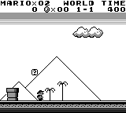

<p align="center">

</p>

__If you have any questions, or just want to chat, [join us on Discord](https://discord.gg/Zrf2nyH).__

[](https://discord.gg/Zrf2nyH)

<!---
Generate GIF with the layout and captions
-->
<table>
  <tbody>
    <tr>
      <td colspan=2 align="center"><a href=https://github.com/PWhiddy/PokemonRedExperiments>Train RL agents to play Pokemon Red</a>
      </td>
      <td align="center"><a href=https://github.com/Baekalfen/PyBoy/wiki/Experimental-and-optional-features#rewind-time>Rewind any game</a><br>
      </td>
    </tr>
    <tr>
      <td colspan=2 align="center">
        <div align="center">
        <a href="http://www.youtube.com/watch?feature=player_embedded&v=DcYLT37ImBY" target="_blank">
        
        <!--  -->
        </a>
        <!-- https://www.youtube.com/watch?v=DcYLT37ImBY -->
        <!-- <br> -->
        </div>
      </td>
      <td align="center">
        
      </td>
    </tr>
    <tr>
      <td align="center">Play the classics<br>
      </td>
      <td align="center"><a href=https://github.com/lixado/PyBoy-RL>Create your own AI</a><br>
      </td>
      <td align="center"><a href=https://github.com/uiucanh/tetris>Beat world records with AI</a><br>
      </td>
    </tr>
    <tr>
      <td align="center">
        
      </td>
      <td align="center">
        
      </td>
      <td align="center">
        
      </td>
    </tr>
  </tbody>
</table>

Getting Started
===============
The instructions are simple:

```sh
$ pip install pyboy
```

For details, see [installation instructions](https://github.com/Baekalfen/PyBoy/wiki/Installation).

Now you're ready! Either use PyBoy directly from the terminal
```sh
$ pyboy game_rom.gb
```

Or use it in your Python scripts:
```python
from pyboy import PyBoy
pyboy = PyBoy('game_rom.gb')
while pyboy.tick():
    pass
pyboy.stop()
```

<!-- Or using the context manager:
```python
from pyboy import PyBoy
with PyBoy('game_rom.gb') as pyboy:
    while pyboy.tick():
        pass
``` -->


The API
=======

If you are looking to make a bot or AI, then these resources are a good place to start:
 * [PyBoy API Documentation](https://baekalfen.github.io/PyBoy/index.html)
 * [Wiki Pages](https://github.com/Baekalfen/PyBoy/wiki/)
   * [Using the Gym](https://github.com/Baekalfen/PyBoy/wiki/Scripts,-AI-and-Bots)
   * [Generic scripts and bots](https://github.com/Baekalfen/PyBoy/wiki/Scripts,-AI-and-Bots)
   * [Examples](https://github.com/Baekalfen/PyBoy/tree/master/examples)
 * [Discord](https://discord.gg/Zrf2nyH)


When the emulator is running, you can easily access [PyBoy's API](https://baekalfen.github.io/PyBoy/index.html):
```python
pyboy.set_emulation_speed(0) # No speed limit
pyboy.button('down')
pyboy.button('a')
pyboy.tick() # Process at least one frame to let the game register the input
value_of_interest = pyboy.memory[0xC345]

pil_image = pyboy.screen.image
pil_image.save('screenshot.png')
```

The [Wiki](https://github.com/Baekalfen/PyBoy/wiki) shows how to interface with PyBoy from your own project.

Performance
===========

Performance is a priority for PyBoy, to make your AI training and scripts as fast as possible.

The easiest way to improve your performance, is to skip rendering of unnecessary frames. If you know your
character takes X frames to move, or the game doesn't take input every frame, you can skip those to potentially triple
your performance. All game logic etc. will still process.

Here is a simple comparison of rendering every frame, rendering every 15th frame, and not rendering any frames (higher is better). See [`pyboy.tick`](https://docs.pyboy.dk/#pyboy.PyBoy.tick) for how it works. Your performance will depend on the game.

<table>
  <tbody>
    <tr>
      <td align="center">
        Full rendering
      </td>
      <td align="center">
        Frame-skip 15
      </td>
      <td align="center">
        No rendering
      </td>
    </tr>
    <tr>
      <td>
      x124 realtime
      </td>
      <td>
      x344 realtime
      </td>
      <td>
      x395 realtime
      </td>
    </tr>
<tr> <!-- Markdown/HTML broken after this -->
<td>

```python
for _ in range(target):
    pyboy.tick()

```
</td>
<td >

```python
for _ in range(target//15):
    pyboy.tick(15, True)

```
</td>
<td >

```python
pyboy.tick(target)

```
</td>
</tr>
  </tbody>
</table>

The Game Boy was originally running at 60 frames per second, so a speed-up of 100x realtime is 6,000 frames per
second. And trivially from the table above, simulating 395 hours of gameplay can be done in 1 hour with no rendering.

It's also recommended to be running multiple instances of PyBoy in parallel. On an 8-core machine, you could potentially
do 3160 hours of gameplay in 1 hour.

Contributing
============
Any contribution is appreciated. The currently known problems are tracked in [the Issues tab](https://github.com/Baekalfen/PyBoy/issues). Feel free to take a swing at any one of them. If you have something original in mind, come and [discuss it on on Discord](https://discord.gg/Zrf2nyH).

[](https://discord.gg/Zrf2nyH)

For the more major features, there are the following that you can give a try. They are also described in more detail in the [project list in the Wiki](https://github.com/Baekalfen/PyBoy/wiki/Student-Projects):
* Hacking games
* Link Cable
* Debugger (VSCode, GDB, terminal or otherwise)
* AI - [use the `api`](https://baekalfen.github.io/PyBoy/index.html) or game wrappers to train a neural network
* Game Wrappers - make wrappers for popular games

If you want to implement something which is not on the list, feel free to do so anyway. If you want to merge it into our repo, then just send a pull request and we will have a look at it.
