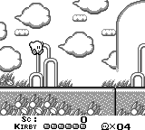
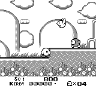

Example: Kirby
==============

PyBoy is loadable as an object in Python. This means, it can be initialized from another script, and be controlled and probed by the script. Take a look at the example below, which interacts with the game.

All external components can be found in the [PyBoy Documentation](../../index). If more features are needed, or if you find a bug, don't hesitate to make an issue here on GitHub, or write on our [Discord channel](https://discord.gg/wUbag3KNqQ).

For Game Boy documentation in general, have a look at the [Pan Docs](https://gbdev.io/pandocs/), which has clear-cut details about every conceivable topic.

| First frame | GIF | Last frame |
| --- | --- | --- |
|  |  |  |

```python
>>> pyboy = PyBoy(kirby_rom)
>>> pyboy.set_emulation_speed(0)
>>> assert pyboy.cartridge_title == "KIRBY DREAM LAN"
>>> pass
>>> kirby = pyboy.game_wrapper
>>> kirby.start_game()
0
>>> pyboy.tick(5) # To render Kirby after `.start_game`
1
>>> pyboy.screen.image.save("Kirby1.png")
>>> pass
>>> from pyboy.utils import WindowEvent
>>> pyboy.send_input(WindowEvent.SCREEN_RECORDING_TOGGLE)  # doctest: +SKIP
>>> pass
>>> assert kirby.score == 0
>>> assert kirby.lives_left == 4
>>> assert kirby.health == 6
>>> pass
>>> pyboy.button_press("right")
>>> for _ in range(280): # Walk for 280 ticks
...     # We tick one frame at a time to still render the screen for every step
...     pyboy.tick(1, True)
1...
>>> pass
>>> assert kirby.score == 800
>>> assert kirby.health == 5
>>> pass
>>> print(kirby)  # doctest: +SKIP
Kirby Dream Land:
Score: 800
Health: 5
Lives left: 4
Sprites on screen:
Sprite [0]: Position: (68, 80), Shape: (8, 16), Tiles: (Tile: 2, Tile: 3), On screen: True
Sprite [1]: Position: (76, 80), Shape: (8, 16), Tiles: (Tile: 18, Tile: 19), On screen: True
Sprite [2]: Position: (102, 31), Shape: (8, 16), Tiles: (Tile: 204, Tile: 205), On screen: True
Sprite [3]: Position: (94, 31), Shape: (8, 16), Tiles: (Tile: 198, Tile: 199), On screen: True
Sprite [4]: Position: (126, 64), Shape: (8, 16), Tiles: (Tile: 152, Tile: 153), On screen: True
Sprite [5]: Position: (118, 64), Shape: (8, 16), Tiles: (Tile: 140, Tile: 141), On screen: True
Tiles on screen:
       0   1   2   3   4   5   6   7   8   9  10  11  12  13  14  15  16  17  18  19
____________________________________________________________________________________
0  | 383 383 383 301 383 383 383 297 383 383 383 301 383 383 383 297 383 383 383 293
1  | 383 383 383 383 300 294 295 296 383 383 383 383 300 294 295 296 383 383 299 383
2  | 311 318 319 320 383 383 383 383 383 383 383 383 383 383 383 383 383 301 383 383
3  | 383 383 383 321 322 383 383 383 383 383 383 198 204 383 383 383 383 383 300 294
4  | 383 383 383 383 323 290 291 383 383 383 313 312 311 318 319 320 383 290 291 383
5  | 383 383 383 383 324 383 383 383 383 315 314 383 383 383 383 321 322 383 383 383
6  | 383 383 383 383 324 293 292 383 383 316 383 383 383 383 383 383 323 383 383 383
7  | 383 383 383 383 324 383 383 298 383 317 383 383 383 383 383 383 324 383 383 383
8  | 319 320 383 383 324 383 383 297 383 317 383 383 383 383 140 152 324 383 383 307
9  | 383 321 322 383 324 294 295 296 383 325 383 383 383 383 383 383 326 272 274 309
10 | 383 383 323 383 326 383 383 383   2  18 383 330 331 331 331 331 331 331 331 331
11 | 274 383 324 272 274 272 274 272 274 272 274 334 328 328 328 328 328 328 328 328
12 | 331 331 331 331 331 331 331 331 331 331 331 328 328 328 328 328 328 328 328 328
13 | 328 328 328 277 278 328 328 328 328 328 328 328 328 277 278 328 328 277 278 277
14 | 328 277 278 279 281 277 278 328 328 277 278 277 278 279 281 277 278 279 281 279
15 | 278 279 281 280 282 279 281 277 278 279 281 279 281 280 282 279 281 280 282 280
>>> pyboy.screen.image.save("Kirby2.png")
>>> pyboy.send_input(WindowEvent.SCREEN_RECORDING_TOGGLE)  # doctest: +SKIP
>>> pyboy.tick()
1
>>> pass
>>> kirby.reset_game()
0
>>> assert kirby.score == 0
>>> assert kirby.health == 6
>>> pass
>>> pyboy.stop()
```