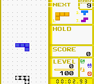

# Example: Pandora's Blocks

PyBoy's {doc}`GameWrapperPandorasBlocks <../../plugins/game_wrapper_pandoras_blocks>`
wraps the homebrew puzzle game and exposes the score, cleared lines, level,
next block, game-over state, and 10-by-18 playfield.



## Running the example

The example script downloads no ROM itself. Supply a copy of Pandora's Blocks;
the doctest below uses the ROM distributed by the PyBoy test fixture.

```sh
python extras/examples/gamewrapper_pandoras_blocks.py "path/to/PandorasBlocks.gbc"
```

Add `--quiet` after the ROM path to run without opening a window.

## Starting a game and inspecting the playfield

```python
>>> blocks_pyboy = PyBoy(pandorasblocks_rom, window="null")
>>> blocks_pyboy.set_emulation_speed(0)
>>> blocks = blocks_pyboy.game_wrapper
>>> assert blocks_pyboy.cartridge_title == "DMGTRIS"
>>> blocks.start_game(timer_div=0)
>>> blocks_pyboy.tick(300, True, False)
True
>>> blocks_pyboy.screen.image.save("PandorasBlocks.png")
>>> assert blocks.score == 0
>>> assert blocks.level == blocks.lines == 0
>>> assert blocks.next_block() in {"I", "Z", "S", "J", "L", "O", "T"}
>>> blocks.set_block("T")
>>> assert blocks.next_block() == "T"
>>> area = blocks.game_area()
>>> assert area.shape == (18, 10)
>>> blocks_pyboy.button_press("right")
>>> blocks_pyboy.tick(30, True)
True
>>> blocks_pyboy.button_release("right")
>>> blocks.reset_game(timer_div=0)
>>> assert blocks.score == blocks.level == blocks.lines == 0
>>> blocks_pyboy.stop(save=False)
```

The wrapper's {meth}`game_area() <pyboy.plugins.game_wrapper_pandoras_blocks.GameWrapperPandorasBlocks.game_area>`
returns tile identifiers for the playfield.
{attr}`mapping_compressed <pyboy.plugins.game_wrapper_pandoras_blocks.GameWrapperPandorasBlocks.mapping_compressed>`
and {attr}`mapping_minimal <pyboy.plugins.game_wrapper_pandoras_blocks.GameWrapperPandorasBlocks.mapping_minimal>`
provide mappings suitable for
{meth}`PyBoy.game_area_mapping() <pyboy.PyBoy.game_area_mapping>`.
