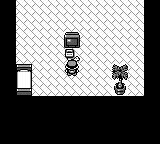
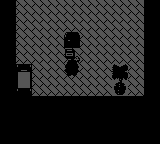
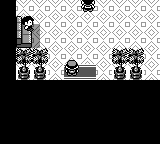

Example: Pokemon Gen 1
======================

PyBoy is loadable as an object in Python. This means it can be initialized from another script and controlled and probed by that script. The Pokemon Gen 1 game wrapper provides access to Pokemon Red and Blue game state and helper functions for manipulating the party, event flags, warps, and battles.

All external components can be found in the [PyBoy Documentation](../../index). For Game Boy documentation in general, have a look at the [Pan Docs](https://gbdev.io/pandocs/).

| After starting the game | During warp transition | After warp transition |
| --- | --- | --- |
|  |  |  |

## Running the example

Give the example a Pokemon Red or Blue ROM:

```bash
python extras/examples/gamewrapper_pokemon.py "ROMs/POKEMON BLUE.gb"
```

Add `--quiet` to run without opening an SDL2 window; in that mode, stop the process with `Ctrl+C` when finished. Without `--quiet`, the example runs the game at normal speed until the window is closed. In either mode, it starts a new game, adds a level 10 Charizard and Mew to the party, enables the Pokedex, and grants all gym badges.

The script is available in the [PyBoy repository](https://github.com/Baekalfen/PyBoy/blob/master/extras/examples/gamewrapper_pokemon.py).

## Example operations

```python
>>> pyboy = PyBoy(pokemon_blue_rom, window="null")
>>> pokemon = pyboy.game_wrapper
>>> pokemon.start_game()
0
>>> pyboy.tick()  # Render the first frame after `.start_game`
1
>>> pyboy.screen.image.save("PokemonGen1-1.png")
>>> pokemon.add_pokemon("CHARIZARD", level=10, moves=("WATERFALL",))
>>> pokemon.add_pokemon("MEW", level=10)
>>> _ = pokemon.party
>>> pass  # Set up the game state for trading and grant all badges.
>>> pokemon.set_event_flag("got_pokedex")
>>> for badge in ("boulder", "cascade", "thunder", "rainbow", "soul", "marsh", "volcano", "earth"):
...     pokemon.set_badge(badge)
>>> pokemon.set_money(999999)
>>> pokemon.set_item("MASTER_BALL", 255, force=True)
>>> pokemon.warp("viridian_pokecenter")
>>> pyboy.tick(20, True, False)  # Capture the fade during the transition
1
>>> pyboy.screen.image.save("PokemonGen1-2.png")
>>> pyboy.tick(30, True, False)  # Finish the transition
1
>>> pyboy.screen.image.save("PokemonGen1-3.png")
```

Pokemon species, moves, trainer classes, maps, and event flags can be specified by their names. Battles can also be scheduled directly:

```python
>>> pyboy = PyBoy(pokemon_blue_rom, window="null")
>>> pokemon = pyboy.game_wrapper
>>> pokemon.start_wild_battle("PIKACHU", level=5)
>>> pokemon.start_trainer_battle("PROF_OAK", trainer_set=1)
```
