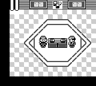
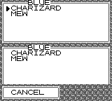
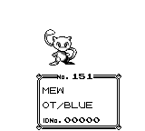

Example: Pokemon Gen 1 Link Trade (Experimental)
================================================

The link-trade example runs two PyBoy instances connected through a shared-memory
Game Boy serial cable. It prepares both games with a party, enters the Cable
Club, and trades a Pokémon using the interrupt-based serial transport.

## Running the example

Give the example a Pokémon Red or Blue ROM:

```bash
python extras/examples/gamewrapper_pokemon_link_trade.py "ROMs/POKEMON BLUE.gb"
```

Both emulator windows are shown by default. Use `--headless` to run without
windows. The example also supports saving the three illustrated states:

```bash
python extras/examples/gamewrapper_pokemon_link_trade.py \
  "ROMs/POKEMON BLUE.gb" \
  --screenshots /tmp/pyboy-link-trade-screenshots
```

The script is available in the
[PyBoy repository](https://github.com/Baekalfen/PyBoy/blob/master/extras/examples/gamewrapper_pokemon_link_trade.py).

## Link-trade states

| Cable Club | Trading menu | Pokémon transfer |
| --- | --- | --- |
|  |  |  |

The two emulators must use compatible Pokémon Red/Blue ROMs. The shared
serial buffer is process-safe and is only intended for two connected
emulators.
