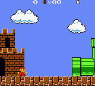

# Example: Super Mario Bros. Deluxe

The {doc}`GameWrapperSuperMarioBrosDeluxe <../../plugins/game_wrapper_super_mario_bros_deluxe>`
wrapper exposes the current world, score, lives, timer, level progress, and a
camera-relative game area. It can also start a selected level, read active
object data, or define a custom level sequence.

Super Mario Bros. Deluxe is a commercial game and its ROM is not included with
PyBoy. Pass a legally obtained ROM file to {doc}`PyBoy <../../api/pyboy>`.



## Running an example

```python
from pyboy import PyBoy

pyboy = PyBoy("path/to/Super Mario Bros. Deluxe.gbc", scale=3)
mario = pyboy.game_wrapper
mario.set_world_level(2, 2)
mario.start_game()

while pyboy.tick():
    pass
```

## Reading game state

The doctest example below selects World 2-2, checks the wrapper's state, and
reads the mapped game area. The ROM is optional for documentation tests; the
example is skipped when it is not available.

```python
>>> mario_pyboy = PyBoy(supermariobrosdeluxe_rom, window="null")
>>> mario_pyboy.set_emulation_speed(0)
>>> mario = mario_pyboy.game_wrapper
>>> mario.set_world_level(2, 2)
>>> mario.start_game()
>>> assert mario.world == (2, 2)
>>> assert mario.level == 5
>>> assert mario.score == 0
>>> assert mario.time_left > 0
>>> area = mario.game_area()
>>> assert area.shape == (26, 20)
>>> assert mario.game_area_background().shape == area.shape
>>> assert all("slot" in obj for obj in mario.object_slots())
>>> mario_pyboy.button_press("right")
>>> mario_pyboy.tick(30, True)
True
>>> mario_pyboy.button_release("right")
>>> mario_pyboy.tick(5, True, False)
True
>>> mario_pyboy.screen.image.save("SuperMarioBrosDeluxe.png")
>>> assert mario.level_progress > 0
>>> mario_pyboy.stop(save=False)
```

Use `super_player_levels=True` with
{meth}`set_world_level() <pyboy.plugins.game_wrapper_super_mario_bros_deluxe.GameWrapperSuperMarioBrosDeluxe.set_world_level>`
to select the For Super Players level set.
{meth}`start_game() <pyboy.plugins.game_wrapper_super_mario_bros_deluxe.GameWrapperSuperMarioBrosDeluxe.start_game>`
accepts `challenge=True` to start a selected level in Challenge mode. Its
`custom_level_sequence` argument can choose which normal levels follow one
another.
