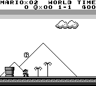
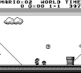

Example: Super Mario Land
=========================

PyBoy is loadable as an object in Python. This means, it can be initialized from another script, and be controlled and probed by the script. Take a look at the example below, which interacts with the game.

All external components can be found in the [PyBoy Documentation](../../index). If more features are needed, or if you find a bug, don't hesitate to make an issue here on GitHub, or write on our [Discord channel](https://discord.gg/wUbag3KNqQ).

For Game Boy documentation in general, have a look at the [Pan Docs](https://gbdev.io/pandocs/), which has clear-cut details about every conceivable topic.

| First frame | GIF | Before hitting Goomba |
| --- | --- | --- |
|  |  |  |

```python
>>> pyboy = PyBoy(supermarioland_rom)
>>> pyboy.set_emulation_speed(0)
>>> assert pyboy.cartridge_title == "SUPER MARIOLAND"
>>> pass
>>> mario = pyboy.game_wrapper
>>> mario.game_area_mapping(mario.mapping_compressed, 0)
>>> mario.start_game()
0
>>> pass
>>> assert mario.score == 0
>>> assert mario.lives_left == 2
>>> assert mario.time_left == 400
>>> assert mario.world == (1, 1)
>>> last_time = mario.time_left
>>> pass
>>> pyboy.tick() # To render screen after `.start_game`
1
>>> pyboy.screen.image.save("SuperMarioLand1.png")
>>> print(mario)
Super Mario Land: World 1-1
Coins: 0
lives_left: 2
Score: 0
Time left: 400
Level progress: 251
Sprites on screen:
Sprite [3]: Position: (35, 112), Shape: (8, 8), Tiles: (Tile: 0), On screen: True
Sprite [4]: Position: (43, 112), Shape: (8, 8), Tiles: (Tile: 1), On screen: True
Sprite [5]: Position: (35, 120), Shape: (8, 8), Tiles: (Tile: 16), On screen: True
Sprite [6]: Position: (43, 120), Shape: (8, 8), Tiles: (Tile: 17), On screen: True
Tiles on screen:
       0   1   2   3   4   5   6   7   8   9  10  11  12  13  14  15  16  17  18  19
____________________________________________________________________________________
0  |   0   0   0   0   0   0   0   0   0   0   0   0   0   0   0   0   0   0   0   0
1  |   0   0   0   0   0   0   0   0   0   0   0   0   0   0   0   0   0   0   0   0
2  |   0   0   0   0   0   0   0   0   0   0   0   0   0   0   0   0   0   0   0   0
3  |   0   0   0   0   0   0   0   0   0   0   0   0   0   0   0   0   0   0   0   0
4  |   0   0   0   0   0   0   0   0   0   0   0   0   0   0   0   0   0   0   0   0
5  |   0   0   0   0   0   0   0   0   0   0   0   0   0   0   0   0   0   0   0   0
6  |   0   0   0   0   0   0   0   0   0   0   0   0   0   0   0   0   0   0   0   0
7  |   0   0   0   0   0   0   0   0   0   0   0   0   0   0   0   0   0   0   0   0
8  |   0   0   0   0   0   0   0   0   0   0   0   0   0   0   0   0   0   0   0   0
9  |   0   0   0   0   0  13   0   0   0   0   0   0   0   0   0   0   0   0   0   0
10 |   0   0   0   0   0   0   0   0   0   0   0   0   0   0   0   0   0   0   0   0
11 |   0   0   0   0   0   0   0   0   0   0   0   0   0   0   0   0   0   0   0   0
12 |   0  14  14   0   1   1   0   0   0   0   0   0   0   0   0   0   0   0   0   0
13 |   0  14  14   0   1   1   0   0   0   0   0   0   0   0   0   0   0   0   0   0
14 |  10  10  10  10  10  10  10  10  10  10  10  10  10  10  10  10  10  10  10  10
15 |  10  10  10  10  10  10  10  10  10  10  10  10  10  10  10  10  10  10  10  10
>>> pass
>>> from pyboy.utils import WindowEvent
>>> pyboy.send_input(WindowEvent.SCREEN_RECORDING_TOGGLE)  # doctest: +SKIP
>>> pyboy.button_press('right')
>>> for n in range(1000):
...     assert mario.time_left <= mario.time_left
...     last_time = mario.time_left
...
...     pyboy.tick(1, True)
...     if n == 120:
...         # Standing right next to the Goomba
...         pyboy.screen.image.save("SuperMarioLand2.png")
...         print(mario)
...     if mario.lives_left == 1:
...         break
... else:
...     print("Mario didn't die?")
...     assert False
1...
Super Mario Land: World 1-1
Coins: 0
lives_left: 2
Score: 0
Time left: 397
Level progress: 367
Sprites on screen:
Sprite [3]: Position: (66, 112), Shape: (8, 8), Tiles: (Tile: 4), On screen: True
Sprite [4]: Position: (74, 112), Shape: (8, 8), Tiles: (Tile: 5), On screen: True
Sprite [5]: Position: (66, 120), Shape: (8, 8), Tiles: (Tile: 20), On screen: True
Sprite [6]: Position: (74, 120), Shape: (8, 8), Tiles: (Tile: 21), On screen: True
Sprite [20]: Position: (81, 120), Shape: (8, 8), Tiles: (Tile: 144), On screen: True
Tiles on screen:
       0   1   2   3   4   5   6   7   8   9  10  11  12  13  14  15  16  17  18  19
____________________________________________________________________________________
0  |   0   0   0   0   0   0   0   0   0   0   0   0   0   0   0   0   0   0   0   0
1  |   0   0   0   0   0   0   0   0   0   0   0   0   0   0   0   0   0   0   0   0
2  |   0   0   0   0   0   0   0   0   0   0   0   0   0   0   0   0   0   0   0   0
3  |   0   0   0   0   0   0   0   0   0   0   0   0   0   0   0   0   0   0   0   0
4  |   0   0   0   0   0   0   0   0   0   0   0   0   0   0   0   0   0   0   0   0
5  |   0   0   0   0   0   0   0   0   0   0   0   0   0   0   0   0   0   0   0   0
6  |   0   0   0   0   0   0   0   0   0   0   0   0   0   0   0   0   0   0   0   0
7  |   0   0   0   0   0   0   0   0   0   0   0   0   0   0   0   0   0   0   0   0
8  |   0   0   0   0   0   0   0   0   0   0   0   0   0   0   0   0   0   0   0   0
9  |   0   0   0   0   0   0   0   0   0   0   0   0  13   0   0   0   0   0   0   0
10 |   0   0   0   0   0   0   0   0   0   0   0   0   0   0   0   0   0   0   0   0
11 |   0   0   0   0   0   0   0   0   0   0   0   0   0   0   0   0   0   0   0   0
12 |   0   0   0   0   0   0   0   0   1   1   0   0   0   0   0   0   0  14  14   0
13 |   0   0   0   0   0   0   0   0   1   1  15   0   0   0   0   0   0  14  14   0
14 |  10  10  10  10  10  10  10  10  10  10  10  10  10  10  10  10  10  10  10  10
15 |  10  10  10  10  10  10  10  10  10  10  10  10  10  10  10  10  10  10  10  10
1...
>>> pyboy.send_input(WindowEvent.SCREEN_RECORDING_TOGGLE)  # doctest: +SKIP
>>> pyboy.tick(1, False)
1
>>> pass
>>> mario.reset_game()
0
>>> assert mario.lives_left == 2
>>> pass
>>> pyboy.stop()
```