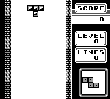
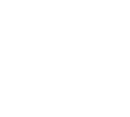

Example: Tetris
===============

PyBoy is loadable as an object in Python. This means, it can be initialized from another script, and be controlled and probed by the script. Take a look at the example below, which interacts with the game.

All external components can be found in the [PyBoy Documentation](../../index). If more features are needed, or if you find a bug, don't hesitate to make an issue here on GitHub, or write on our [Discord channel](https://discord.gg/wUbag3KNqQ).

For Game Boy documentation in general, have a look at the [Pan Docs](https://gbdev.io/pandocs/), which has clear-cut details about every conceivable topic.

| First frame | GIF | Last frame |
| --- | --- | --- |
|  |  |  |

```python
>>> pyboy = PyBoy(tetris_rom)
>>> pyboy.set_emulation_speed(0)
>>> assert pyboy.cartridge_title == "TETRIS"
>>> pass
>>> tetris = pyboy.game_wrapper
>>> tetris.game_area_mapping(tetris.mapping_compressed, 0)
>>> tetris.start_game(timer_div=0x00) # The timer_div works like a random seed in Tetris
0
>>> pyboy.tick() # To render screen after `.start_game`
1
>>> pyboy.screen.image.save("Tetris1.png")
>>> pass
>>> from pyboy.utils import WindowEvent
>>> pyboy.send_input(WindowEvent.SCREEN_RECORDING_TOGGLE)  # doctest: +SKIP
>>> pass
>>> tetromino_at_0x00 = tetris.next_tetromino()
>>> assert tetromino_at_0x00 == "Z", tetris.next_tetromino()
>>> assert tetris.score == 0
>>> assert tetris.level == 0
>>> assert tetris.lines == 0
>>> pass
>>> pass  # Checking that a reset on the same `timer_div` results in the same Tetromino
>>> tetris.reset_game(timer_div=0x00)
0
>>> assert tetris.next_tetromino() == tetromino_at_0x00, tetris.next_tetromino()
>>> pass
>>> blank_tile = 0
>>> game_area = tetris.game_area()
>>> first_brick = True
>>> for frame in range(1000): # Enough frames for the test. Otherwise do: `while pyboy.tick():`  # doctest: +SKIP
...     pyboy.tick(1, True)
...
...     # The playing "technique" is just to move the Tetromino to the right.
...     if frame % 2 == 0: # Even frames to let PyBoy release the button on odd frames
...         pyboy.button("right")
...
...     # Illustrating how we can extract the game board quite simply. This can be used to read the tile identifiers.
...     game_area = tetris.game_area()
...     # game_area is accessed as [<row>, <column>].
...     # 'game_area[-1,:]' is asking for all (:) the columns in the last row (-1)
...     if not first_brick and any(filter(lambda x: x != blank_tile, game_area[-1, :])):
...         first_brick = True
...         print("First brick touched the bottom!")
...         print(tetris)
1
...
First brick touched the bottom!
Tetris:
Score: 0
Level: 0
Lines: 0
Sprites on screen:
Sprite [4]: Position: (72, 128), Shape: (8, 8), Tiles: (Tile: 129), On screen: True
Sprite [5]: Position: (80, 128), Shape: (8, 8), Tiles: (Tile: 129), On screen: True
Sprite [6]: Position: (88, 128), Shape: (8, 8), Tiles: (Tile: 129), On screen: True
Sprite [7]: Position: (88, 136), Shape: (8, 8), Tiles: (Tile: 129), On screen: True
Sprite [8]: Position: (120, 112), Shape: (8, 8), Tiles: (Tile: 130), On screen: True
Sprite [9]: Position: (128, 112), Shape: (8, 8), Tiles: (Tile: 130), On screen: True
Sprite [10]: Position: (128, 120), Shape: (8, 8), Tiles: (Tile: 130), On screen: True
Sprite [11]: Position: (136, 120), Shape: (8, 8), Tiles: (Tile: 130), On screen: True
Tiles on screen:
       0   1   2   3   4   5   6   7   8   9
____________________________________________
0  |   0   0   0   0   0   0   0   0   0   0
1  |   0   0   0   0   0   0   0   0   0   0
2  |   0   0   0   0   0   0   0   0   0   0
3  |   0   0   0   0   0   0   0   0   0   0
4  |   0   0   0   0   0   0   0   0   0   0
5  |   0   0   0   0   0   0   0   0   0   0
6  |   0   0   0   0   0   0   0   0   0   0
7  |   0   0   0   0   0   0   0   0   0   0
8  |   0   0   0   0   0   0   0   0   0   0
9  |   0   0   0   0   0   0   0   0   0   0
10 |   0   0   0   0   0   0   0   0   0   0
11 |   0   0   0   0   0   0   0   0   0   0
12 |   0   0   0   0   0   0   0   0   0   0
13 |   0   0   0   0   0   0   0   0   0   0
14 |   0   0   0   0   0   0   0   0   0   0
15 |   0   0   0   0   0   0   0   0   0   0
16 |   0   0   0   0   0   0   0   1   1   1
17 |   0   0   0   0   0   0   0   0   0   1
...
>>> pass
>>> pass  # Final game board:
>>> print(tetris)  # doctest: +SKIP
Tetris:
Score: 0
Level: 0
Lines: 0
Sprites on screen:
Sprite [4]: Position: (72, 24), Shape: (8, 8), Tiles: (Tile: 130), On screen: True
Sprite [5]: Position: (80, 24), Shape: (8, 8), Tiles: (Tile: 130), On screen: True
Sprite [6]: Position: (80, 32), Shape: (8, 8), Tiles: (Tile: 130), On screen: True
Sprite [7]: Position: (88, 32), Shape: (8, 8), Tiles: (Tile: 130), On screen: True
Sprite [8]: Position: (120, 112), Shape: (8, 8), Tiles: (Tile: 133), On screen: True
Sprite [9]: Position: (128, 112), Shape: (8, 8), Tiles: (Tile: 133), On screen: True
Sprite [10]: Position: (136, 112), Shape: (8, 8), Tiles: (Tile: 133), On screen: True
Sprite [11]: Position: (128, 120), Shape: (8, 8), Tiles: (Tile: 133), On screen: True
Tiles on screen:
       0   1   2   3   4   5   6   7   8   9
____________________________________________
0  |   0   0   0   0   0   0   0   0   0   0
1  |   0   0   0   0   0   0   0   0   0   0
2  |   0   0   0   0   0   0   0   0   0   0
3  |   0   0   0   0   0   0   0   2   2   0
4  |   0   0   0   0   0   0   0   0   2   2
5  |   0   0   0   0   0   0   0   0   0   0
6  |   0   0   0   0   0   0   0   0   0   0
7  |   0   0   0   0   0   0   0   0   0   0
8  |   0   0   0   0   0   0   0   0   0   0
9  |   0   0   0   0   0   0   0   0   0   0
10 |   0   0   0   0   0   0   0   0   0   0
11 |   0   0   0   0   0   0   0   0   0   0
12 |   0   0   0   0   0   0   0   0   0   0
13 |   0   0   0   0   0   0   0   0   0   0
14 |   0   0   0   0   0   0   0   0   0   0
15 |   0   0   0   0   0   0   0   0   0   0
16 |   0   0   0   0   0   0   0   1   1   1
17 |   0   0   0   0   0   0   0   0   0   1
>>> pyboy.screen.image.save("Tetris2.png")
>>> pyboy.send_input(WindowEvent.SCREEN_RECORDING_TOGGLE)  # doctest: +SKIP
>>> pass
>>> pass  # We shouldn't have made any progress with the moves we made
>>> assert tetris.score == 0
>>> assert tetris.level == 0
>>> assert tetris.lines == 0
>>> pass
>>> pass  # The game area has 18 rows and 10 columns.
>>> assert game_area.shape == (18, 10)
>>> tetris.reset_game(timer_div=0x00)
0
>>> assert tetris.next_tetromino() == tetromino_at_0x00, tetris.next_tetromino()
>>> pass
>>> tetris.reset_game(timer_div=0x00)
0
>>> assert tetris.next_tetromino() == tetromino_at_0x00, tetris.next_tetromino()
>>> pass  # After resetting, we should have a clean game area
>>> game_area = tetris.game_area()
>>> assert not any(filter(lambda x: x != blank_tile, game_area[-1, :]))
>>> pass
>>> tetris.reset_game(timer_div=0x55) # The timer_div works like a random seed in Tetris
0
>>> assert tetris.next_tetromino() != tetromino_at_0x00, tetris.next_tetromino()
>>> pass
>>> pass  # Testing that it defaults to random Tetrominos
>>> selection = set()
>>> for _ in range(10):
...     _ = tetris.reset_game()
...     selection.add(tetris.next_tetromino())
>>> assert len(selection) > 1 # If it's random, we will see more than one kind
>>> pass
>>> pyboy.stop()
```