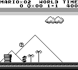
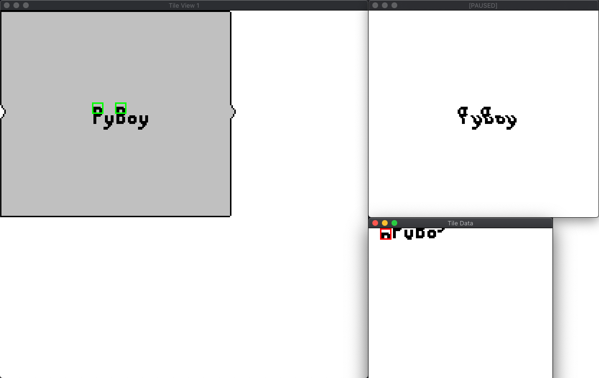

# Experimental and optional features

You can always run `pyboy --help` to find an overview of available features and options:

```sh
$ python -m pyboy --help
usage: python3.14 -m pyboy [-h] [-b BOOTROM] [--no-input]
                           [--log-level {CRITICAL,ERROR,WARNING,INFO,DEBUG}]
                           [--color-palette COLOR_PALETTE]
                           [--cgb-color-palette CGB_COLOR_PALETTE] [-l [LOADSTATE]]
                           [-w {SDL2,OpenGL,GLFW,null}] [-s SCALE] [--no-renderer]
                           [--gameshark GAMESHARK] [--dmg | --cgb]
                           [--no-sound-emulation] [--sound |
                           --sound-volume SOUND_VOLUME]
                           [--sound-sample-rate SOUND_SAMPLE_RATE] [--title-status]
                           [-d] [--autopause] [--record-input] [--rewind]
                           [--breakpoints BREAKPOINTS]
                           ROM

PyBoy -- Game Boy emulator written in Python

positional arguments:
  ROM                   Path to a Game Boy compatible ROM file

options:
  -h, --help            show this help message and exit
  -b BOOTROM_FILE, --bootrom BOOTROM_FILE
                        Path to a boot-ROM file
  --log-level {ERROR,WARNING,INFO,DEBUG,DISABLE}
                        Set logging level
...
Warning: Features marked with (internal use) might be subject to change.
```


Game Windows
-------------------------

PyBoy is bundled with several window implementations. The recommended is `SDL2`, and its installation is described in the installation instructions.

The installations instructions here, will be sparse, as they are mostly for the technically interested.

1. `SDL2` : Covered by the default installation.
2. `OpenGL` : Install OpenGL, FreeGLUT and OpenAL-soft through the system's package manager. Install `pyopengl` and optionally `pyopengl-accelerate` through pip.
3. `GLFW` : Install GLFW and OpenAL-soft through the system's package manager. Install `glfw` and `PyOpenAL` through pip. On macOS, it might be necessary to set this: `export DYLD_LIBRARY_PATH="/opt/homebrew/opt/openal-soft/lib"`
4. `null` : No installation required. Doesn't show anything on the screen.

The "window" can be chosen via the arguments supplied to Python. For example:

    python3 -m pyboy gamerom.gb --window SDL2


Screen Recording
----------------

If the `pillow` package is available, PyBoy can record video from the screen and save it in a `.gif` file. This requires the following additional dependencies:

    # Linux
    sudo apt install libsdl2-dev libtiff5-dev libjpeg8-dev zlib1g-dev

    # Mac
    brew install libjpeg libtiff
Install the pillow package with `pip`:

    python3 -m pip install pillow

PyBoy will detect whether `pillow` is present, and screen recording can be triggered with the `I` key.


Rewind Time
----------------

By providing the `--rewind` flag when starting PyBoy, you'll be able to pause the emulation, and rewind the game (for example before you lost the game).

Use the `,` and `.` keys to wind backwards and forwards.



Debugging
--------

By providing the `--debug` flag when starting PyBoy, you'll be presented with multiple windows showing the inner workings of the graphics of PyBoy.


